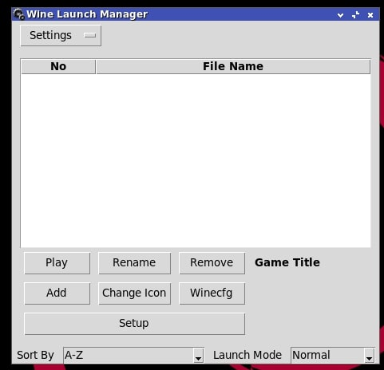
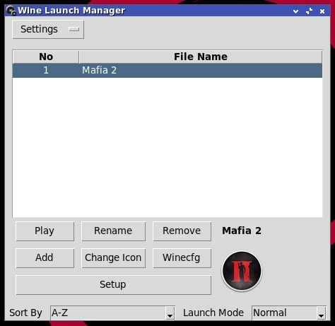
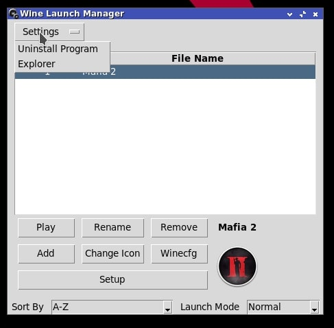

# WLM - Wine Launch Manager

Wine Launch Manager (WLM) is a Python3-based application for managing Vanilla Wine applications on Linux distributions.

---

## Screenshot

---

## How to Use WLM?

### **Before Using, Ensure:**

1. You have installed Wine Vanilla correctly according to your distro.
2. You have installed the following Python packages:
   - `python3-tkinter`
   - `python3-pillow`
   - `python3-pillow-imagetk`
   *(Use the commands below or adjust according to your distribution.)*

---

### **Installation Commands (Debian-Based, adjust for other distros):**

```bash
sudo apt install python3-tk python3-pil python3-pil.imagetk
```

## WLM Menu

## How to Play?
1. **Play Button**: Runs the application that has been added to the shortcut list.
2. **Rename Button**: Renames the shortcut in the list.
3. **Remove Button**: Deletes an application from the shortcut list.
4. **Add Button**: Adds an application to the shortcut list menu (.exe file).
5. **Change Icon Button**: Changes the launcher icon (\*.ico, \*.png).
6. **Winecfg Button**: Opens the Wine Vanilla configuration.
7. **Launch Mode Button**: For Counter FPS using GalliumHUD & Mangohud (GL or VK)

## WLM Settings

### **Settings Menu:**

- **Uninstaller**: Uninstalls programs installed within Wine.
- **Explorer**: Opens the file manager or explorer inside Wine.

---

## How to Uninstall WLM?

### **Safer Method (File Manager):**

Simply delete the `wlm` directory using your file manager:

```
~/wlm
```

### **Terminal Method:**

```bash
rm -rf ~/wlm
```

---
