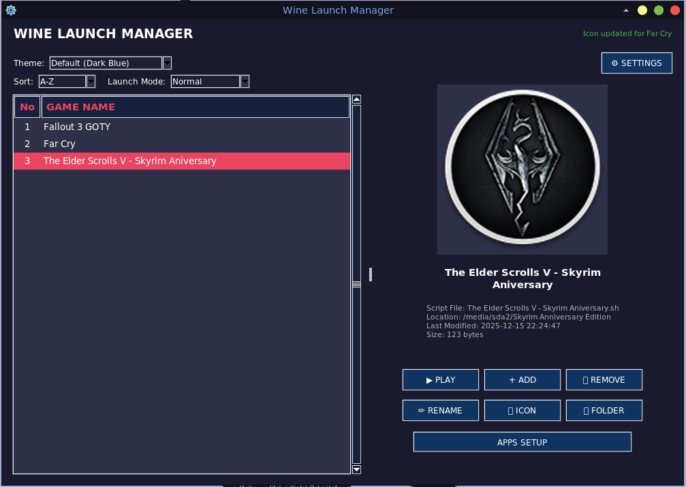
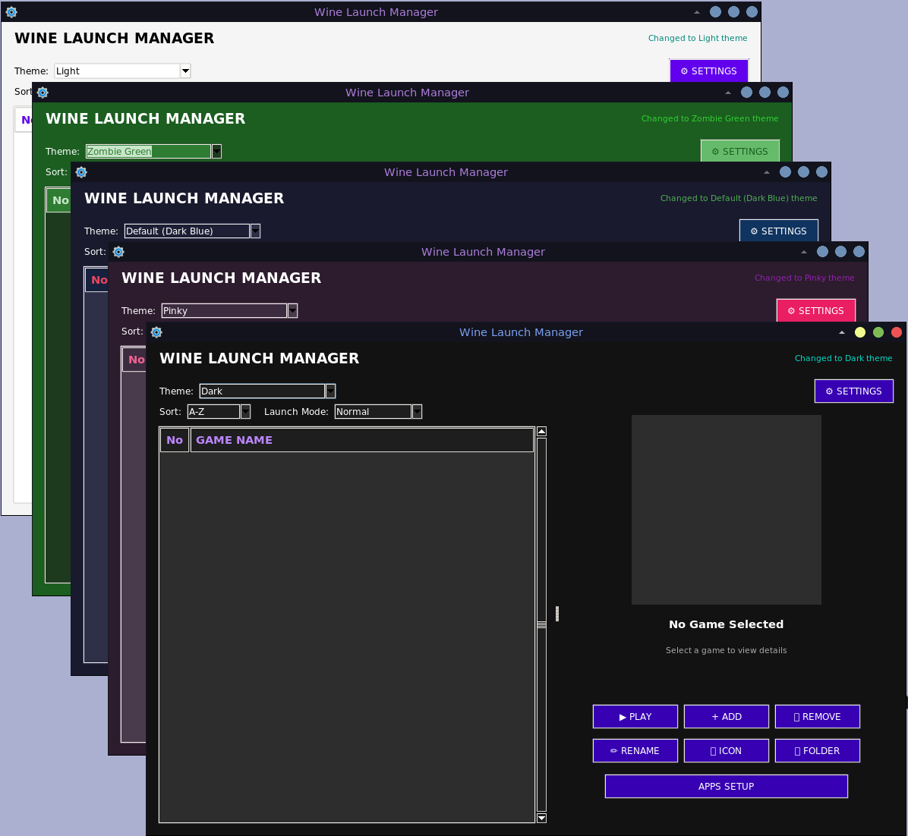
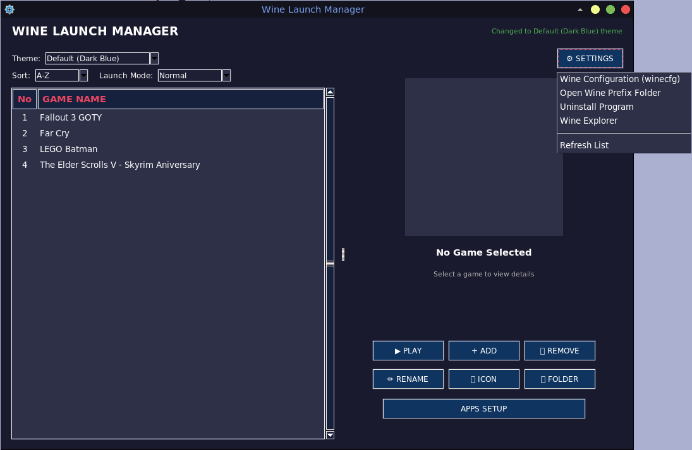

# WLM - Wine Launch Manager WLM 0.1.0 (Beta)

Wine Launch Manager (WLM) is a Python3-based application for managing Vanilla Wine applications on Linux distributions.

---

## Screenshot

---

## How to Use WLM?

### **Before Using, Ensure:**

1. You have installed Wine Vanilla correctly according to your distro.
2. You have installed the following Python packages:
   - `python3-tkinter`
   - `python3-pillow`
   - `python3-pillow-imagetk`
   *(Use the commands below or adjust according to your distribution.)*

---

## Install the required components or packages

### **Debian / Ubuntu / Linux Mint**
```bash
sudo apt install python3-tk python3-pil python3-pil.imagetk
```

### **Arch Linux / Manjaro**
```bash
sudo pacman -Syu
sudo pacman -S tk python-pillow
```

### **Fedora**
```bash
sudo dnf install python3-tkinter python3-pillow
```

### **Void Linux**
```bash
sudo xbps-install -S
sudo xbps-install python3-tkinter python3-Pillow
```

### **Alpine Linux**
```bash
sudo apk update
sudo apk add python3 py3-tkinter py3-pillow
```

---

## Steps to Run WLM:

1. Download the latest version of WLM.
2. Open a terminal in the directory where the file has been downloaded (e.g., `~/Downloads`).
3. Extract the archive and move it to your home directory:
   ```bash
   tar -xf wlm.tar.gz -C ~/
   ```
4. Navigate to the WLM directory:
   ```bash
   cd ~/wlm/
   ```
5. Run the WLM script:
   ```bash
   ./WLM.sh
   ```

**Note:** Alternatively, you can extract the archive using your file manager, navigate to the Home directory (`~/`), and double-click `WLM.sh` to run it.

---

## WLM Menu & Theme

---

## Features:

- Manage Vanilla Wine applications via a user-friendly GUI.
- Integrate Winetricks for additional Wine configurations.
- Uninstall applications installed within Wine.
- Display FPS using GalliumHUD or MangoHUD.
- Create and manage shortcut lists in the Launcher.
---
## How to Play?
1. **Play Button**: Runs the application that has been added to the shortcut list.
2. **Rename Button**: Renames the shortcut in the list.
3. **Remove Button**: Deletes an application from the shortcut list.
4. **Add Button**: Adds an application to the shortcut list menu (.exe file).
5. **Change Icon Button**: Changes the launcher icon (*.ico, *.png).
6. **Launch Mode Button**: For Counter FPS using GalliumHUD & Mangohud (GL or VK)

## WLM Settings

### **Settings Menu:**

- **Winecfg Button**: Opens the Wine Vanilla configuration.
- **Open Wine Prefix Folder**: Opens Wine Prefix Folder.
- **Uninstaller**: Uninstalls programs installed within Wine.
- **Wine Explorer**: Opens the file manager or explorer inside Wine.
- **Refresh**: Just Refresh.

---

## How to Uninstall WLM?

### **Safer Method (File Manager):**

Simply delete the `wlm` directory using your file manager:

```
~/wlm
```

### **Terminal Method:**

```bash
rm -rf ~/wlm
```

---
