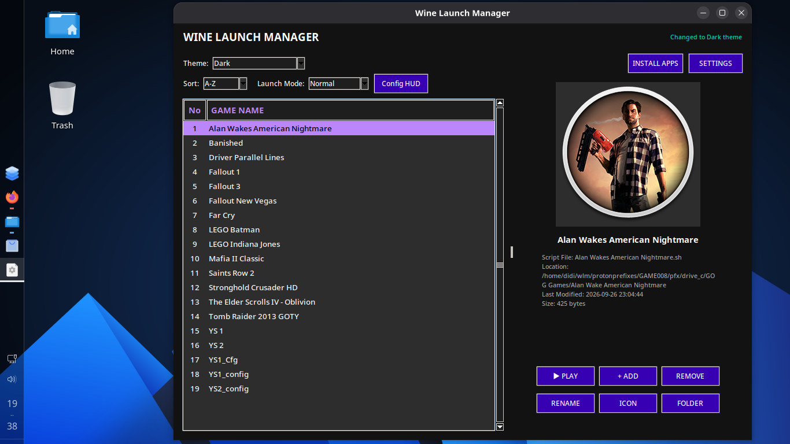
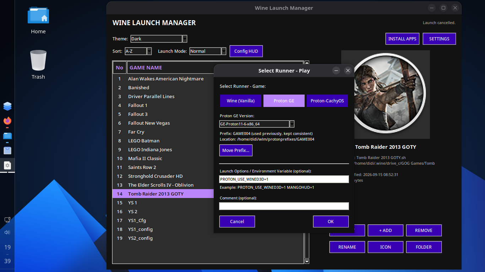
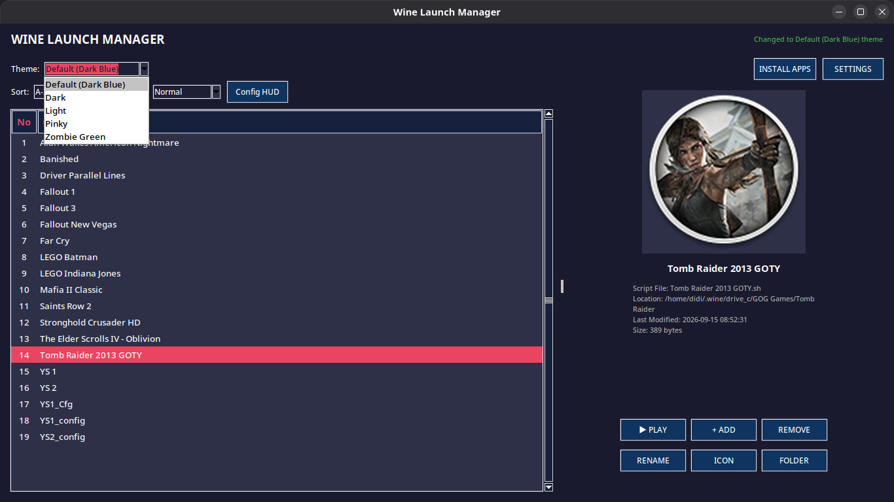
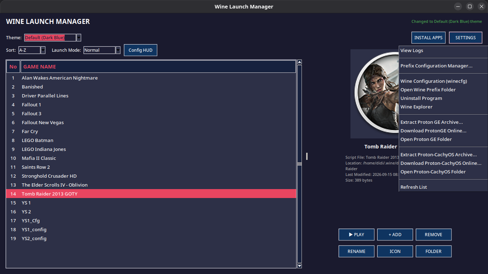

## WLM - Wine Launch Manager

Wine Launch Manager (WLM) is a Python3-based application for managing Vanilla Wine, Proton GE, and Proton-CachyOS applications on Linux distributions.



---

## How to Use WLM?

### **Before Using for installed packet, Ensure:**

1. You have installed Wine Vanilla correctly (Optional).
2. You have installed the following Python packages:
   - `python3-tkinter`
   - `python3-pillow`
   - `python3-pillow-imagetk`
   - `python3-yaml` *(optional — used for the customizable `env_config.yaml`; WLM falls back to built-in defaults if this isn't installed)*
   - `xdg-utils`

   *(Use the commands below or adjust according to your distribution.)*

### Note: Alternatively, you can use the **AppImage** version for a portable app.

---

### **Debian / Ubuntu / Linux Mint**
```bash
sudo apt install python3-tk python3-pil python3-pil.imagetk python3-yaml xdg-utils
```

### **Arch Linux / Manjaro**
```bash
sudo pacman -Syu
sudo pacman -S tk python-pillow python-yaml xdg-utils
```

### **Fedora**
```bash
sudo dnf install python3-tkinter python3-pillow python3-pyyaml xdg-utils
```

---

## Install using *.deb or *.rpm:


### **Debian/Ubuntu/Mint Linux**
```bash
sudo apt update
sudo apt install ./winelaunchmanager_x.x.x_amd64.deb
```
> Using `apt install ./file.deb` (instead of `dpkg -i`) lets apt automatically resolve and download all required dependencies (`python3-tk`, `python3-pil`, etc.) from your distro's repositories.
>
> If you install with `dpkg -i winelaunchmanager_x.x.x_amd64.deb` instead and it complains about missing dependencies, just run:
> ```bash
> sudo apt --fix-broken install
> ```

### **Fedora Linux**
```bash
sudo dnf install ./winelaunchmanager-x.x.x*.rpm
```

---

## WLM Menu & Theme


---

## Features
- Manage Vanilla Wine applications via a user-friendly GUI.
- Manage Proton GE or Proton-CachyOS in WLM, including downloading builds directly from GitHub.
- Customizable `env_config.yaml` to override the Proton GE / Proton-CachyOS release URLs used by the "Download Online" feature.
- Make a custom prefix using a custom runner or the default runner, with a configurable default storage location per runner.
- Manage your Windows apps & games prefixes, including moving a prefix to a different folder/disk.
- Backup and restore a prefix as a `.tar.gz` archive, with live progress and the ability to cancel mid-way.
- Uninstall applications installed within Wine.
- Display FPS using GalliumHUD, VulkanHUD (MangoHud), with configurable metrics and scale.
- Create and manage a shortcut list in the Launcher, with per-game icons.
- Live log window for running games/apps and Winetricks output.

---

## How to Play?
1. **Play Button**: Runs the application that has been added to the shortcut list.
2. **Rename Button**: Renames the shortcut in the list.
3. **Remove Button**: Deletes an application from the shortcut list.
4. **Add Button**: Adds an application to the shortcut list menu (`.exe` file).
5. **Change Icon Button**: Changes the launcher icon (`.ico`, `.png`).
6. **Launch Mode Button**: For FPS counter using GalliumHUD & MangoHud (GL or VK).

## WLM Settings


### **Settings Menu:**
- **Winecfg Button**: Opens the Wine Vanilla configuration.
- **Extract ProtonGE/ProtonCachyOS**: Extract a runner Proton build from your downloaded file (`.tar.gz`).
- **Download ProtonGE/ProtonCachyOS Online**: Fetch and extract a build directly from GitHub Releases.
- **Open Wine/ProtonGE/ProtonCachyOS Prefix Folder**: Opens the prefix folder in your file manager.
- **Uninstaller**: Uninstalls programs installed within Wine.
- **Wine Explorer**: Opens the file manager/explorer inside Wine.
- **Refresh**: Just refresh the shortcut list.

---

## Command Line

Check which version of WLM you have installed without opening the GUI:

```bash
$ winelaunchmanager --version
WLM Version: 0.x.x-x
Developer: Opensource OS Gathering Republic (OOGR)
Maintener: Didi Sloth Stanca
```

---

## How to Uninstall WLM?

### **If installed via .deb/.rpm:**
```bash
# Debian/Ubuntu/Mint
sudo apt remove winelaunchmanager

# Fedora
sudo dnf remove winelaunchmanager
```
Your game/app prefixes and settings under `~/wlm` are **not** removed automatically — see below if you want to delete those too.

### **Removing WLM's data folder (prefixes, settings, logs):**

**Safer Method (File Manager):**

Simply delete the `wlm` directory using your file manager:
```
~/wlm
```

**Terminal Method:**
```bash
rm -rf ~/wlm
```
> ⚠️ This removes every Wine/Proton prefix WLM created (all your installed Windows apps and games inside them), along with themes, window position, and the prefix registry. Back up anything you want to keep first.

---

## License

GPL-V3.0 Lisence — see the `LICENSE` file for details.
