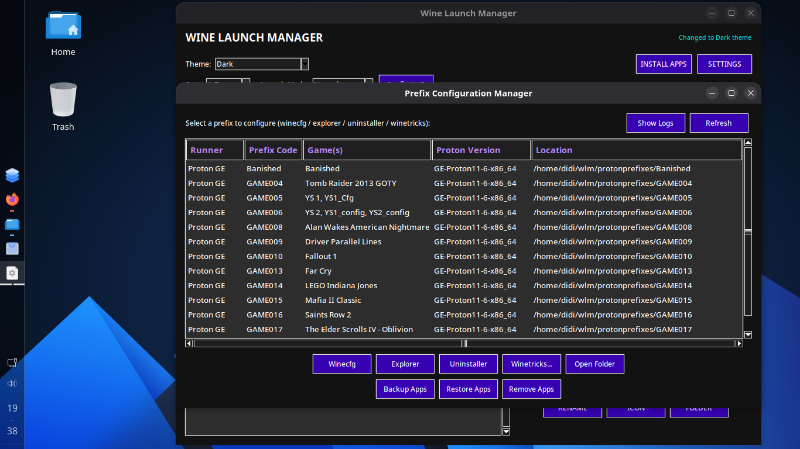
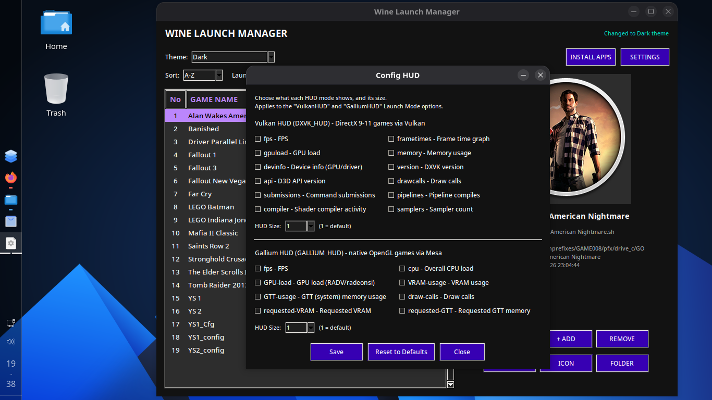

## WLM - Wine Launch Manager

Wine Launch Manager (WLM) is a Python3-based application for managing Vanilla Wine, Proton GE, and Proton-CachyOS applications on Linux distributions. It also includes a GOG Store client, a Save Manager, and a cover-art game library.


---

## How to Use WLM?

### **Before Using for installed packet, Ensure:**

1. You have installed the following Python packages:
   - `python3-tkinter`
   - `python3-pillow`
   - `python3-pillow-imagetk`
   - `python3-yaml` *(optional — used for the customizable `env_config.yaml`; WLM falls back to built-in defaults if this isn't installed)*
   - `xdg-utils`

   *(Use the commands below or adjust according to your distribution.)*

2. *(Optional)* Wine Vanilla is only needed if you use the **Wine (Vanilla)** runner. Proton GE and Proton-CachyOS use the Wine bundled inside their own folders, so a system-wide Wine is not required for them.

### Note: Alternatively, you can use the **AppImage** version for a portable app.

---

### **Debian / Ubuntu / Linux Mint**
```bash
sudo apt install python3-tk python3-pil python3-pil.imagetk python3-yaml xdg-utils
```

### **Arch Linux / Manjaro**
```bash
sudo pacman -Syu
sudo pacman -S tk python-pillow python-yaml xdg-utils
```

### **Fedora**
```bash
sudo dnf install python3-tkinter python3-pillow python3-pyyaml xdg-utils
```

---

## Optional Extras

None of these are required to start WLM. Install only what you need:

| Package | Needed for |
|---|---|
| `winetricks` | Winetricks features inside a prefix |
| `mangohud` | The **Mangohud** / **MangoHud-GL** launch modes (GalliumHUD and VulkanHUD need no extra package) |
| `pywebview` + GTK/WebKit2GTK | The built-in GOG login browser (without it, use the manual login: open the GOG page in your normal browser and paste the redirect URL) |

### **Debian / Ubuntu / Linux Mint**
```bash
sudo apt install winetricks mangohud python3-webview python3-gi
```

### **Arch Linux / Manjaro**
```bash
sudo pacman -S winetricks mangohud python-pywebview python-gobject
```

### **Fedora**
```bash
sudo dnf install winetricks mangohud python3-gobject
```
> Fedora has no pywebview package in its repositories (as far as we could find), so the built-in GOG login browser is not available there out of the box. Use the manual GOG login instead (open the GOG page in your normal browser and paste the redirect URL).

> If the GOG login window does not open or stays blank, also install the WebKit2GTK package for your distribution.

---

## Install using *.deb or *.rpm:


### **Debian/Ubuntu/Mint Linux**
```bash
sudo apt update
sudo apt install ./winelaunchmanager_*_amd64.deb
```
> Using `apt install ./file.deb` (instead of `dpkg -i`) lets apt automatically resolve and download all required dependencies (`python3-tk`, `python3-pil`, etc.) from your distro's repositories.
>
> If you install with `dpkg -i winelaunchmanager_*_amd64.deb` instead and it complains about missing dependencies, just run:
> ```bash
> sudo apt --fix-broken install
> ```

### **Fedora Linux**
```bash
sudo dnf install ./winelaunchmanager_*_x86_64.rpm
```

---

## WLM Menu & Theme


### List Theme Available (ugly but ok)
- Default (Dark Blue).
- Dark
- Light
- Pinky
- Green Zombie
---

## Features

### What Feature Available?
- Manage Vanilla Wine applications via a user-friendly GUI.
- Manage Proton GE or Proton-CachyOS in WLM, including downloading builds directly from GitHub.
- Customizable `env_config.yaml` to override the Proton GE / Proton-CachyOS release URLs used by the "Download Online" feature.
- Make a custom prefix using a custom runner or the default runner, with a configurable default storage location per runner.
- Manage your Windows apps & games prefixes, including moving a prefix to a different folder/disk.
- Backup and restore a prefix as a `.tar.gz` archive, with live progress and the ability to cancel mid-way.
- Uninstall applications installed within Wine.
- Create and manage a shortcut list in the Launcher, with per-game icons.
- Cover-art grid view for your game library (covers are looked up by title, loaded lazily and cached), with a plain list view as an alternative.
- **GOG Store**: log in through the official GOG page, browse your library, and download games either as offline installers (**Download Setup**) or straight from the GOG Galaxy content system (**Direct Download**: resumable, no installer needed).
- **Save Manager** (**SAVES** button): local save backup/restore, plus GOG cloud save check and download (a backup is made automatically before anything is overwritten).
- Shortcuts are created automatically after installing a game (via **INSTALL APPS** or the GOG Store).
- Live log window for running games/apps and Winetricks output.
  

- Display FPS using GalliumHUD, VulkanHUD, & MangoHud (External Configuration), with configurable metrics and scale.

---

## GOG Store & Saves

- **Login**: done on the official GOG page. Your password never passes through WLM; only an OAuth token is stored in `~/wlm/gog_auth.json` (permission 600). You can log in with the built-in mini browser (needs `pywebview` + GTK/WebKit2GTK) or manually by pasting the redirect URL.
- **Settings**: endpoints, download folder, and OS/language filters are read from `~/wlm/gog_config.json`, created automatically on first use.
- **Download Setup**: downloads the offline installer (`setup_*.exe` + `.bin`) and can run it through your chosen runner.
- **Direct Download**: downloads the game files directly into `~/wlm/gog_games/<game>/` (or your configured `game_dir`). Re-running it on the same folder only downloads missing or changed files. Redistributables (VC++/DirectX) are **not** installed automatically.
- **Cloud saves**: **Check Cloud** compares cloud and local files without changing anything; **Download & Overwrite** replaces local files with the same name after a warning and an automatic backup. Uploading to the cloud is intentionally not available.
- **Local backups** are stored in `~/wlm/save_backups/<game>/*.tar.gz`.

---

## How to Play?
1. **Play Button**: Runs the application that has been added to the shortcut list.
2. **Rename Button**: Renames the shortcut in the list.
3. **Remove Button**: Deletes an application from the shortcut list.
4. **Add Button**: Adds an application to the shortcut list menu (`.exe` file).
5. **Change Icon Button**: Changes the launcher icon (`.ico`, `.png`).
6. **Launch Mode Button**: For FPS counter using GalliumHUD & MangoHud (GL or VK).

## WLM Settings


### **Settings Menu:**
- **Winecfg Button**: Opens the Wine Vanilla configuration.
- **Extract ProtonGE/ProtonCachyOS**: Extract a runner Proton build from your downloaded file (`.tar.gz`).
- **Download ProtonGE/ProtonCachyOS Online**: Fetch and extract a build directly from GitHub Releases.
- **Open Wine/ProtonGE/ProtonCachyOS Prefix Folder**: Opens the prefix folder in your file manager.
- **Uninstaller**: Uninstalls programs installed within Wine.
- **Wine Explorer**: Opens the file manager/explorer inside Wine.
- **Refresh**: Just refresh the shortcut list.

---

## Command Line

Check which version of WLM you have installed without opening the GUI:

```bash
$ winelaunchmanager --version
WLM Version: 0.4.7-Beta
Developer: Opensource OS Gathering Republic (OOGR)
Maintener: Didi Sloth Stanca
```

---

## How to Uninstall WLM?

### **If installed via .deb/.rpm:**
```bash
# Debian/Ubuntu/Mint
sudo apt remove winelaunchmanager

# Fedora
sudo dnf remove winelaunchmanager
```
Your game/app prefixes and settings under `~/wlm` are **not** removed automatically — see below if you want to delete those too.

### **Removing WLM's data folder (prefixes, settings, logs):**

**Safer Method (File Manager):**

Simply delete the `wlm` directory using your file manager:
```
~/wlm
```

**Terminal Method:**
```bash
rm -rf ~/wlm
```
> ⚠️ This removes every Wine/Proton prefix WLM created (all your installed Windows apps and games inside them), along with themes, window position, the prefix registry, your GOG login token, covers, save backups, and any games downloaded by Direct Download into `~/wlm/gog_games`. Back up anything you want to keep first.

---

## License

GPL-V3.0 Lisence — see the `LICENSE` file for details.
